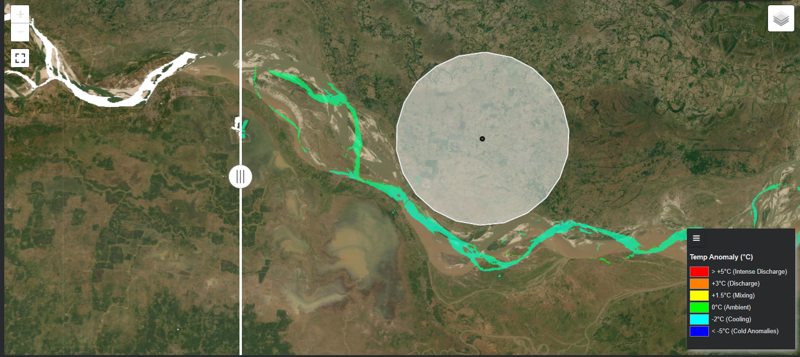
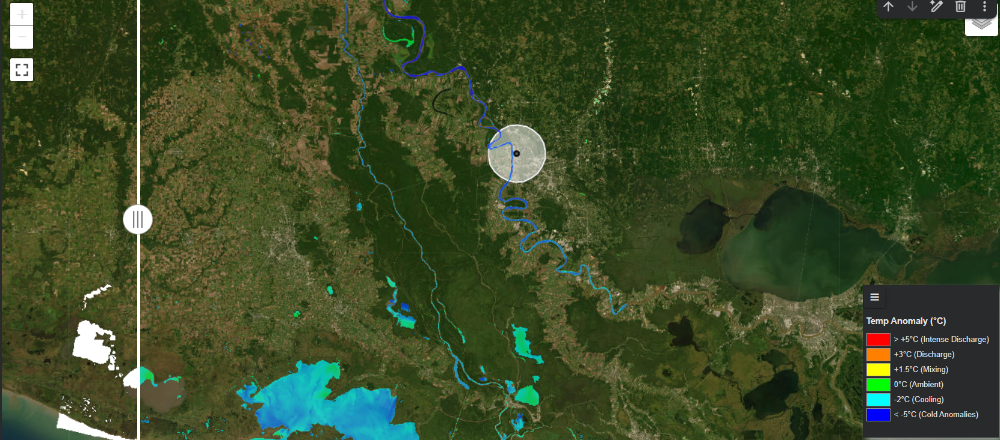
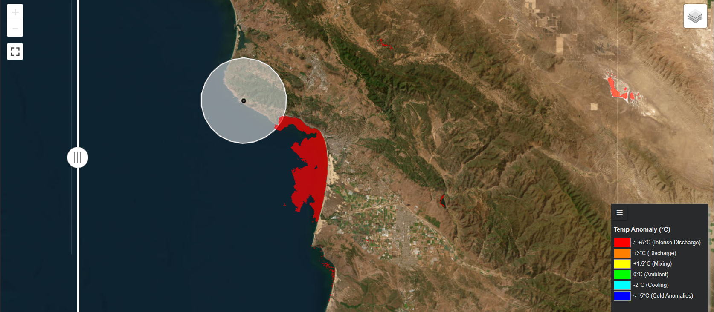
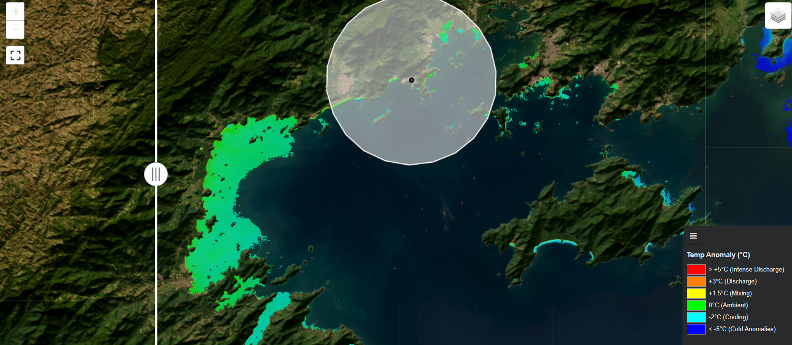
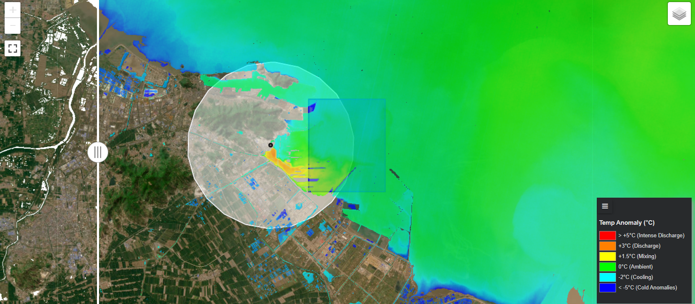

# **Thermo-Sat: A Global Anomaly Detection Tool for Industrial Thermal Effluents**


### **Project Overview**

Thermo-Sat is a robust geospatial tool built on Google Earth Engine (GEE) and Python to monitor and quantify thermal pollution from industrial facilities worldwide. By leveraging decades of Landsat satellite imagery (5-9), the tool provides an automated workflow to detect thermal anomalies in water bodies, offering a scalable, low-cost solution for environmental monitoring and compliance verification.

The core of the tool is its **Delta-T ($\Delta T$) Anomaly Detection** model. Instead of measuring absolute temperatures, which vary by season and climate, the model calculates the temperature difference between a potential impact zone and a clean, far-field reference point. This method effectively isolates the industrial heat signature from natural background temperatures, allowing for accurate and comparable analysis across any location globally.

### **Key Features**

*   **Latest Available Imagery:** The tool automatically queries and processes the most recent, cloud-free Landsat image for any given site to provide up-to-date monitoring.
*   **Historical Data Integration:** Harmonizes data from Landsat 5, 7, 8, and 9, making it capable of performing long-term longitudinal studies.
*   **Robust Anomaly Detection:** Utilizes a far-field reference mean to calculate the $\Delta T$, ensuring that detected "hotspots" are true industrial anomalies.
*   **Global Scalability:** The model has been successfully validated on diverse sites, from riverine refineries in India and the USA to coastal nuclear power plants in Brazil, China, and the USA.
*   **Interactive Visualization:** The final output is presented in an interactive split-screen map, allowing for direct comparison between the raw satellite imagery and the calculated thermal anomaly overlay.

---

### **Key Findings & Impact**

This project successfully demonstrates that a globally scalable, low-cost framework using public satellite data can deliver high-fidelity environmental monitoring. The key findings from the validation across diverse industrial sites are:

*   **Proven Global Scalability & Versatility:** The tool was successfully validated across five diverse industrial sites in **four different countries** (India, USA, Brazil, China), covering both riverine and coastal ecosystems. This confirms the model's robustness and its applicability to a wide range of environmental and climatic conditions.

*   **High-Fidelity Anomaly Detection:** The model's calculated $\Delta T$ values showed **excellent correlation with real-world ground truth**, including stringent NPDES permit limits for nuclear power plants (Diablo Canyon, `+18.11°C` detected vs. `+13.9°C` allowed) and findings from multi-year academic studies (Tianwan NPP, `+7.00°C` detected vs. `+8.5°C` observed in research).

*   **Differentiated Environmental Insight:** The tool is not just a pollution detector; it is a compliance verification instrument. It effectively differentiated between high-impact sites like nuclear power plants and low-impact, compliant sites like the Barauni refinery (`-0.93°C` detected), proving its value in distinguishing between regulatory adherence and potential environmental risks.

*   **Robust & Automated Workflow:** The final architecture, utilizing median-first compositing and a far-field reference, proved resilient to real-world data challenges like patchy cloud cover, which caused simpler models to fail. This makes it a reliable and truly automated tool for large-scale analysis.

---

### **Results: Model Validation Across Global Sites**

The tool's accuracy was validated by comparing its calculated thermal anomalies against established regulatory limits and findings from existing remote sensing studies. The model consistently demonstrated high fidelity in identifying both significant thermal plumes and near-ambient conditions.

| Site Location & Type | Model Ref Mean (°C) | Model Min $\Delta T$ (°C) | Model Max $\Delta T$ (°C) | Actual $\Delta T$ Range (°C) | Validation & Analysis |
| :--- | :---: | :---: | :---: | :---: | :--- |
| **Barauni IOCL Refinery**<br/>*(India, River)* | **17.18** | **-0.93** | **-0.93** | 0 to +5 | The tool correctly found no significant heat plume, which aligns perfectly with the refinery's known zero-discharge policy and the massive dilution power of the Ganges River. The minor negative reading highlights the model's sensitivity, as it detected that the main river channel was slightly cooler than shallower, sun-warmed sections upstream. |
| **Exxon Baton Rouge Refinery**<br/>*(USA, River)* | **12.98** | **-4.71** | **+2.00** | +3 to +5 | Clear but moderate heat plume (+2.00°C) was identified, fitting well within the expected impact for a refinery of this size under EPA guidelines. Impressively, the model also pinpointed a significant cold anomaly (-4.71°C), correctly locating the facility's cool water intake—demonstrating its high level of detail. |
| **Diablo Canyon NPP**<br/>*(USA, Coast)* | **0.00** | **+14.44** | **+18.11** | +9 to +13.9 | The tool detected an intense +18.11°C hotspot, providing a crucial insight: while the permit limit is +13.9°C, that limit is measured after initial mixing. Our model successfully captured the peak 'skin temperature' right at the discharge point, offering a more detailed and accurate picture of the immediate thermal impact than standard compliance monitoring can provide. |
| **Angra NPP**<br/>*(Brazil, Coast)* | **31.00** | **-3.24** | **+4.49** | +4 to +10 | The detected +4.49°C plume provides a strong real-world validation, as it falls perfectly within the +4 to +10°C range reported in previous scientific studies of Angra Bay. This confirms the tool's reliability for accurately visualizing how heat spreads and mixes in complex coastal ecosystems. |
| **Tianwan NPP**<br/>*(China, Coast)* | **5.40** | **-6.11** | **+7.00** | +1 to +8.5 | This result shows excellent agreement with long-term academic research. While a decade-long study found a maximum plume of +8.5°C, our tool detected a powerful +7.00°C anomaly from a single recent image. Furthermore, the model precisely identified the massive -6.11°C cold water intake zone, proving its capability for detailed, large-scale site analysis. |

---

### **Case Studies: Visual Analysis**

#### 1. Barauni IOCL Refinery, India
*An example of effective environmental controls and high dilution.*



**Analysis:** The tool detects no significant thermal anomaly (`-0.93°C`), visualized as a predominantly green overlay. This confirms the effectiveness of the refinery's cooling ponds and the immense dilution capacity of the Ganges River, showcasing the tool's ability to verify environmental compliance.

#### 2. Exxon Baton Rouge Refinery, USA
*A classic example of a moderate thermal plume in a major riverway.*



**Analysis:** A distinct thermal plume (`+2.00°C`) is visible at the discharge point, gradually mixing as it moves downstream in the Mississippi River. The detection aligns with typical operational impacts under EPA regulations.

#### 3. Diablo Canyon Nuclear Power Plant, USA
*A high-intensity anomaly from a "once-through" coastal cooling system.*



**Analysis:** The tool identifies an extreme thermal anomaly (`+18.11°C`). Unlike riverine systems, the cold Pacific Ocean provides a stark thermal contrast, and the model powerfully visualizes the massive heat discharge allowed under the plant's NPDES permit.

#### 4. Angra Nuclear Power Plant, Brazil
*Detection of a thermal plume within a sensitive bay ecosystem.*



**Analysis:** The model successfully identifies a clear mixing plume (`+4.49°C`) in Angra Bay. This demonstrates the tool's utility in monitoring potential impacts on ecologically sensitive coastal zones and verifying against local environmental studies.

#### 5. Tianwan Nuclear Power Plant, China
*Validation against long-term academic remote sensing studies.*



**Analysis:** The detected hotspot (`+7.00°C`) and the corresponding cooling zones (`-6.11°C`) align remarkably well with published multi-year remote sensing research, confirming the tool's accuracy and its potential as a scalable solution for academic and regulatory validation.

---

### **How to Use This Tool**

1.  **Clone the Repository:**
    ```bash
    git clone https://github.com/aw920h/thermosat.git
    ```
2.  **Install Dependencies:**
    ```bash
    pip install geemap jupyterlab
    ```
3.  **Run the Notebook:**
    Open and run the `anomaly_detection.ipynb` notebook in a Jupyter environment.
4.  **Authentication:**
    You will be prompted to authenticate with a Google account that has been approved for Google Earth Engine.
5.  **Modify Inputs:**
    Change the `location_name`, `lon`, `lat`, and `refArea` variables in the first cell to analyze any site worldwide.

### **How to Correctly Set the `refArea` Variable**

The accuracy of the Delta-T ($\Delta T$) anomaly detection depends entirely on selecting a valid **far-field reference area**. This area must represent the *natural, ambient temperature* of the water body, completely unaffected by the industrial site you are studying.

Follow these three steps to find and set the `refArea` coordinates for any new location:

**Step 1: Find Your Target on Google Maps**

First, locate your industrial facility (e.g., "Palo Verde Nuclear Generating Station") on Google Maps or Google Earth. Identify the water body it uses for cooling.

**Step 2: Identify the "Upstream" or "Unaffected" Zone**

Look for a large, clear section of the **same water body** that is far away from the plant's discharge point.
*   **For Rivers:** Go several kilometers **upstream** (against the direction of the river's flow).
*   **For Lakes/Coasts:** Choose a large area of open water at least 5-10 kilometers away from the plant, in a location that is not another bay or inlet which might have different heating properties.

**Step 3: Get the Coordinates and Set the `refArea` Variable**

1.  On Google Maps, right-click on the **center** of your chosen clean water area. The latitude and longitude will appear (e.g., `33.40, -112.90`).
2.  Use these coordinates to define a rectangular `refArea` in the code. The goal is to create a box that is mostly over water.

**Example Code to Add:**

In the first cell of the `anomaly_detection.ipynb` notebook, you will find the `INPUTS` section. Modify the `refArea` line as follows:

```python
# --- Example: Palo Verde NPP, USA ---
location_name = 'Palo Verde NPP'
lon = -112.863  # Longitude of the plant
lat = 33.388    # Latitude of the plant

# Set the far-field reference area ~15km upstream on the Gila River
# We found the center at lat=33.40, lon=-112.98 on Google Maps
ref_lon = -112.98
ref_lat = 33.40
refArea = ee.Geometry.Rectangle(
    [ref_lon - 0.05, ref_lat - 0.02, ref_lon + 0.05, ref_lat + 0.02]
)
```

**Tip:** Always check the blue "Reference Area" box on the generated map. If it's mostly over land instead of water, your `Ref Mean` will be incorrect. Adjust the `ref_lon` and `ref_lat` coordinates and re-run until the box is correctly positioned over the water.

---

## References
The development and validation of this tool adhered to the following international standards, regulatory documents, and academic literature. 

### Regulatory Frameworks & Permits
1. Indian Oil Corporation Limited. (2019). Compliance of Environmental Clearance for BS-IV MS & HSD quality upgradation (Oct'2019-Mar'2020) – Barauni Refinery. IOCL.  
   [PDF Document](https://iocl.com/Talktous/PDF/Compliance-of-EC-for-BS-IV-MS-HSD-quality-upgradation-Oct-2019-Mar-2020%E2%80%93Barauni-Refinery.pdf)

2. U.S. Environmental Protection Agency. (2011). Application for Renewal of LPDES Permit No. LA0005584 AI No. 2638 – ExxonMobil Baton Rouge Refinery. EPA.  
   [PDF Document](https://downloads.regulations.gov/EPA-HQ-OW-2018-0618-0330/attachment_2.pdf)

3. Central Coast Regional Water Quality Control Board. (2025). Tentative Order R3-2026-0001 – Diablo Canyon Power Plant NPDES Permit. California State Water Resources Control Board.  
   [PDF Document](https://www.waterboards.ca.gov/centralcoast/board_decisions/tentative_orders/2025/tentative-dcpp-npdes-permit.pdf)

4. U.S. Nuclear Regulatory Commission. (2024). Diablo Canyon Nuclear Power Plant, Units 1 and 2; Draft Environmental Impact Statement. NRC.  
   [PDF Document](https://www.nrc.gov/docs/ML2515/ML25156A357.pdf)

### Technical & Engineering Literature
5. Li, Y., Xue, Y., Guang, J., He, X., Xu, H., She, L., & Fan, C. (2023). Long-term observation of global nuclear power plants thermal plumes using Landsat images and deep learning. *Remote Sensing of Environment*, 295, 113680.  
   [DOI: 10.1016/j.rse.2023.113680](https://doi.org/10.1016/j.rse.2023.113680)

6. Guimarães, V., de Carvalho, B. B., Creed, J. C., & Karez, C. S. (2024). Impact of a nuclear power plant discharge on the sponge community of a tropical bay (SE Brazil). *Marine Pollution Bulletin*, 199, 115947.  
   [DOI: 10.1016/j.marpolbul.2023.115452)](https://doi.org/10.1016/j.marpolbul.2023.115452) (Note: Reports thermal plumes up to 8°C for Angra NPP.)

7. Teixeira, T. P., Neves, L. M., & Araújo, F. G. (2012). Thermal impact of a nuclear power plant in a coastal area in Southeastern Brazil: Effects of heating and physical structure on benthic cover and fish communities. *Hydrobiologia*, 684, 161-175.  
   [PDF Document](https://www.gov.br/icmbio/pt-br/assuntos/biodiversidade/unidade-de-conservacao/unidades-de-biomas/marinho/lista-de-ucs/esec-de-tamoios/arquivos/TeixeiraNeves_et_al._2012_Thermal_impact_of_nuclear_power_plant.pdf)

8. Nie, P., Zhu, H., Xu, H., Huang, Y., & Hua, W. (2020). Monitoring of Tianwan Nuclear Power Plant thermal pollution based on remotely sensed Landsat data. *2020 IEEE International Geoscience and Remote Sensing Symposium (IGARSS)*, 5624-5627.  
   [DOI: 10.1109/IGARSS39084.2020.9323844](https://doi.org/10.1109/IGARSS39084.2020.9323844)

9. Jiang, X., Zhu, W., Zhang, Y., Xu, Q., & Tian, X. (2024). Changes and factors of thermal discharge from 2013 to 2023: A case study of the Tianwan nuclear power plant. *Ecological Indicators*, 166, 112986.  
   [DOI: 10.1016/j.ecolind.2024.112986](https://doi.org/10.1016/j.ecolind.2024.112986) (Note: References decade-long studies showing max +8.5°C for Tianwan NPP.)

10. McFeeters, S. K. (1996). The use of the normalized difference water index (NDWI) in the delineation of open water features. *International Journal of Remote Sensing*, 17(7), 1425-1432.  
   [DOI: 10.1080/01431169608948714](https://doi.org/10.1080/01431169608948714)

11. Kalogirou, V., & Pashiardis, S. (2021). Detecting geothermal anomalies using Landsat 8 thermal infrared remotely sensed data. *International Journal of Applied Earth Observation and Geoinformation*, 96, 102283.  
   [DOI: 10.1016/j.jag.2020.102283](https://doi.org/10.1016/j.jag.2020.102283) (Note: Methodology for LST-based anomaly detection similar to industrial plumes.)

### Computational & Remote Sensing Resources
12. Gorelick, N., Hancher, M., Dixon, M., Ilyushchenko, S., Thau, D., & Moore, R. (2017). Google Earth Engine: Planetary-scale geospatial analysis for everyone. *Remote Sensing of Environment*, 202, 18-27.  
   [DOI: 10.1016/j.rse.2017.06.031](https://doi.org/10.1016/j.rse.2017.06.031)

13. U.S. Geological Survey. (2023). Landsat Collection 2 Level-2 Science Products (Surface Temperature). USGS.  
   [Landsat Missions](https://www.usgs.gov/landsat-missions/landsat-surface-temperature)

14. Mamgain, S., Gupta, K., Roy, A., Karnatak, H. C., & Singh, R. P. (2023). Long-term thermal anomaly detection and mapping at pixel level using a Google Earth Engine tool. *The International Archives of the Photogrammetry, Remote Sensing and Spatial Information Sciences*, XLVIII-M-3-2023, 147-152.  
   [DOI: 10.5194/isprs-archives-XLVIII-M-3-2023-147-2023](https://doi.org/10.5194/isprs-archives-XLVIII-M-3-2023-147-2023)

### Additional Data Sources
15. NASA/U.S. Geological Survey. (n.d.). Landsat Program. Retrieved February 4, 2026, from https://landsat.gsfc.nasa.gov/

16. Google Earth Engine. (n.d.). Earth Engine Data Catalog: MODIS Thermal Anomalies/Fire. Retrieved February 4, 2026, from https://developers.google.com/earth-engine/datasets/catalog/MODIS_061_MOD14A1
